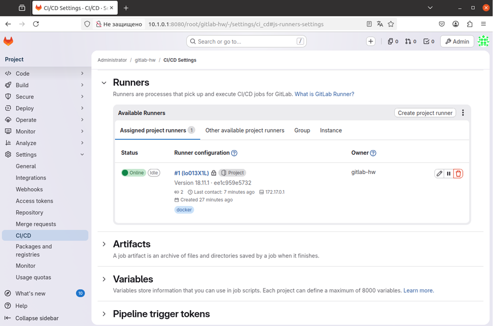
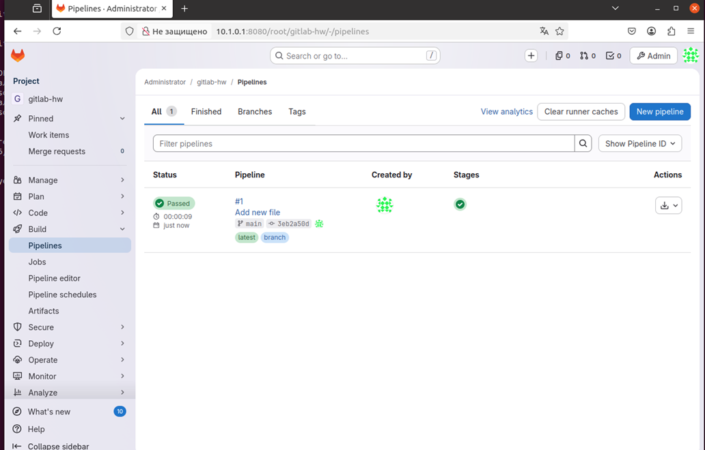

# Домашнее задание по лекции "GitLab""

**Студент:** Лев Городилов

---

## Задание 1: Развертывание GitLab и регистрация Runner

GitLab успешно запущен в Docker-контейнере. Runner зарегистрирован и подключен к проекту.

**Скриншот статуса Runner (Online):**

---

## Задание 2: Описание и запуск Pipeline

Был создан файл `.gitlab-ci.yml` для запуска тестовой задачи (job). Раннер успешно подхватил задачу и выполнил её.

**Скриншот со списком Pipelines (Passed):**

